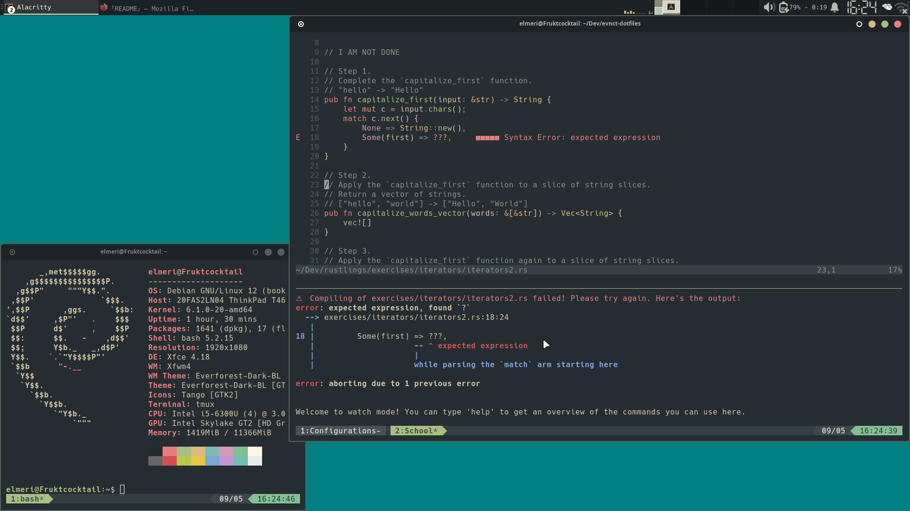

###  | Alacritty  | Tmux   | Fish   | Neovim | Zathura

> [Remember] If this configuration does not work for you, I don't care.

### Usage

I'm assuming you have already installed the tools. If so, continue.

```
git clone https://github.com/evnct/evnct-dotfiles.git
cd evnct-dotfiles/.config
cp -r nvim tmux alacritty fish zathura ~/.config/
```

Also put Tmux to ~
```
cp ~/.config/tmux/.tmux.conf ~/
```

### Font

These configurations are using **Hack Nerd Font**.
Download it from [here](https://www.nerdfonts.com/font-downloads).

### Showcase


